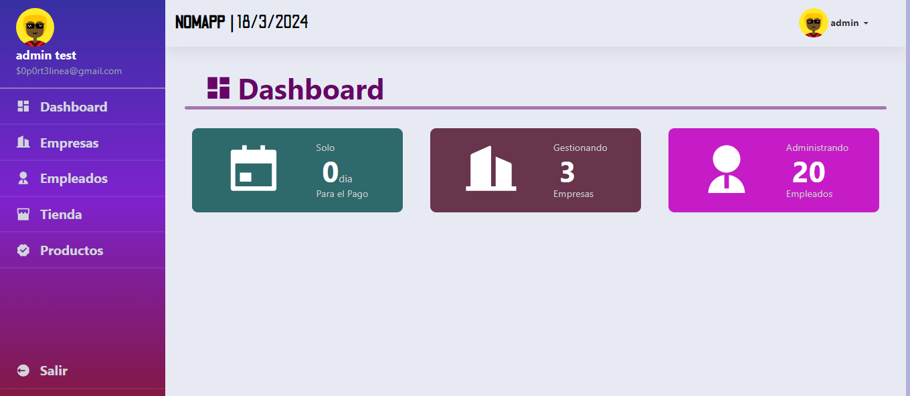

<a name="readme-top"></a>

<div align="center">

# 💵 NOMAPP 💱

[](./README.md)
[](./README.es.md)

## La aplicación de control de nominas 💰 multiempresa 🏢



NOMAPP es una aplicacion que te ofrece manejar la nomina de multipes empresas, manejar pagos y creditos del personal de las empreas.

Visite el [sitio web] de prueba (https://ccardona.pythonanywhere.com/) para saber más.
Utilice estas credenciales: nombre de usuario: **admin** contraseña: **abc123/-**

</div>

# ⚙️ Información Técnica
Para la creacion de NOMAPP se utilizaron proyectos de codigo abierto para funcioanr correctamente y facilitar el desarrollo.


<p style="margin-left:30px;display:flex; width:100%; red; align-items:center; gap:5px; margin-bottom: 10px">
  <a style="display:flex; align-items:center; gap:5px">
    
    Python
  </a>
  para la creación del backend.
</p>

<p style="margin-left:30px;display:flex; width:100%; red; gap:5px; margin-bottom: 10px; align-items:center">
  <a style="display:flex; align-items:center; gap:5px">
    
    Docker
  </a>
  Como contenedor y lanzar una máquina virtual.
</p>

<p style="margin-left:30px;display:flex; width:100%; red; gap:5px; margin-bottom: 10px; align-items:center">
  <a style="display:flex; align-items:center; gap:5px">
    
    Node JS
  </a>
  para la instalación de paquetes requeridos por el frontend.
</p>

# 🚀 Instalación

NOMAPP esta creado con un backend en python con ayuda de Django y con el frontend con la ayuda de React.js, por lo que dependiendo de cual de estos desee isntalar o correr debera seguir los sigueintes pasos:

<details open>
<summary style="font-size:24px; font-weight:bold">Backend 🛠️</summary>

<p>
  <a style="display:flex; gap: 5px; font-size: 25px; color: rgba(12,75,51); font-weight:bold; align-items:center; margin-bottom: 20px;margin-top: 0">
    
    Django
  </a>
</p>

Requiere <a href="https://www.python.org">Python</a> v3.8+ o una version mayor para correr.
Asi como de requiere que se cuente con <a href="https://pip.pypa.io/en/stable/installation/">pip</a> instalado el cual es manejador de paquetes de <a href="https://www.python.org">Python</a>

> - Se recomienda el uso de un entorno virtual para controlar de mejor manera las dependencias a instalar.

\
  En lo personal utilizamos el paquete virtualenwrapper para el manejo de los entornos virtuales este se instala con el comando
  ```sh
  # Si se utiliza un sistema operativo basado en linux
  pip install virtualenvwrapper

  # En caso de ser un sistema operativo windows
  pip install virtaulenvwrapper-win
  ```
  Luego que se tiene instalado el paquete se procede a realizar el ingresar el siguiente comando

  ```sh
  # Creacion del entorno virtual
  mkvirtualenv #nombre del entorno

  # Al crear el entorno este se activa automaticamente
  ```
  tal como se muestra en la siguiente imagen podemos ver el entorno virtual activo llamado **nomapp**
  
  caso contrario si lo que deseamos es activar nuestro entorno virtual debemos ingresar el comando **workon** seguido del nombre de entorno


  ```sh
    workon #nombre del entorno
  ```
  En la siguiente imagen podemos obeservar el uso del comando workon
  
  gracias a plugins que se tienen instalados en mi terminal esta muestra los posibles entornos en el equipo sin embargo lo que continua luego del comapndo workon es el nombre del entorno en el cual se esta trabajando.

Instalar las dependencias, verifique el se encuentre el documento requirements.txt en la raiz del proyecto.
```sh
pip install -r requirements.txt
```
Recolectar los archivos estaticos, para este punto se debio realizar el build de react, para tener los ultimos cambios y cargar los estaticos que servira Django, se debe de aseguar de encontrarse a mismo nivel que el archivo manage.py.
```sh
python manage.py collectstatic
```
Configurar Base de Datos, dependiendo de que base de datos se dese utilizar se debera configurar esta configuracion se encuentra en local.py que se encuentra en la carpeta app/settings/

```sh
# Configuracion para usar Base de Datos predeterminada
DATABASES = {
    'default': {
        'ENGINE': 'django.db.backends.sqlite3',
        'NAME': BASE_DIR / 'db.sqlite3',
    }
}

# Configuracion para usar Base de Datos de postgresql
DATABASES = {
    'default': {
        'ENGINE': 'django.db.backends.postgresql_psycopg2',
        'NAME': 'database_name',
        'USER': 'user_postgres',
        'PASSWORD': 'password_user',
        'HOST': 'localhost',
        'PORT': '5432'
    }
}
```

Crear y correr las migraciones, este comando se utiliza para crear o modificar las migraciones que manejan los cambios en la base de datos del ORM de django.

```sh
# Crea las migraciones para la modificacion en Base de Datos
python manage.py makemigrations
# Corre las migraciones y realiza los cambios en la base de datos
python manage.py migrate
```

👨‍💻 Correr el proyecto..! Si se realizaron correctamente todas las configuraciones y se corrieron con exito los comandos anteriroes el proyecto se correra en el puerto 8000, si desea cambiar el puerto se le debe especificar en el siguiente comando.
```sh
# Corre el proyecto en el puerto 8000
python manage.py runserver

# Corre el proyecto en el puerto especificado
python manage.py runsever 'Puerto'
```

</details>


<details open>
  <summary style="font-size:24px; font-weight:bold">Frontend 🪟</summary>

  > El frontend en esta aplicación se realizo con React, sin embargo este se debe realizar en modo desarrollo luego ejecutar el comando build para construir el proyecto y realizar un collectsatic para recolectar los archivos del fronent y pueda servirlos Django.
  <p>
    <a style="display:flex; gap: 5px; font-size: 25px; color: rgba(8,126,164); font-weight:bold; align-items:center; margin-bottom: 20px;margin-top: 0">
      
      React
    </a>
  </p>
</details>
Para la instalcion de react.js unicamente debemos realizar la instalacion de los paquetes:

#### Instalacion de Paquetes

* pnpm
```bash
pnpm install
```
Si todo va bien debera mostrar los paquetes instalados..!


para poder levantar la aplicacion de prueba debemos correr el comando start
```bash
pnpm run start
```
Al ejecutar correctamente levantara el proyecto mostrando la informacion del servidor y la url donde este esta corriendo:


En este punto ya se pueden realizar los cambios que se crean necesarios a la parte del frontend, sin olvidar construir el projecto y recolectar los staticos con el baceknd en django para que todo funcione correctamtene.

**Gracias por todo, estás invitado a contribuir o aportar ideas o temas.**

[](https://github.com/devkev53/nomapp/graphs/contributors)

<p align="right">(<a href="#readme-top">volver arriba</a>)</p>