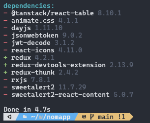

<a name="readme-top"></a>

<div align="center">

# 💵 NOMAPP 💱

[](./README.md)
[](./README.es.md)

## The payroll control application 💰 multi-company 🏢


NOMAPP is an application that offers you to manage the payroll of multiple companies, manage payments and credits of company personnel.

Visit the test [website] (https://ccardona.pythonanywhere.com/) to learn more.
Use these credentials: username: **admin** password: **abc123/-**

</div>

# ⚙️ Technical Information
For the creation of NOMAPP, open source projects were used to function correctly and facilitate development.


<p style="margin-left:30px;display:flex; width:100%; red; align-items:center; gap:5px; margin-bottom: 10px">
  <a style="display:flex; align-items:center; gap:5px">
    
    Python
  </a>
  for the creation of the backend.
</p>

<p style="margin-left:30px;display:flex; width:100%; red; gap:5px; margin-bottom: 10px; align-items:center">
  <a style="display:flex; align-items:center; gap:5px">
    
    Docker
  </a>
  as a container and launch a virtual machine.
</p>

<p style="margin-left:30px;display:flex; width:100%; red; gap:5px; margin-bottom: 10px; align-items:center">
  <a style="display:flex; align-items:center; gap:5px">
    
    Node JS
  </a>
  for the installation of packages required by the frontend.
</p>

# 🚀 Installation

NOMAPP is created with a backend in python with the help of Django and with the frontend with the help of React.js, so depending on which of these you want to install or run, you should follow the following steps:

<details open>
<summary style="font-size:24px; font-weight:bold">Backend 🛠️</summary>

<p>
  <a style="display:flex; gap: 5px; font-size: 25px; color: rgba(12,75,51); font-weight:bold; align-items:center; margin-bottom: 20px;margin-top: 0">
    
    Django
  </a>
</p>

Requires <a href="https://www.python.org">Python</a> v3.8+ or higher to run.
As well as it requires that you have <a href="https://pip.pypa.io/en/stable/installation/">pip</a> installed which is a <a href="https package manager ://www.python.org">Python</a>

> - It is recommended to use a virtual environment to better control the dependencies to be installed.

\
  Personally, we use the virtualenwrapper package to manage virtual environments, this is installed with the command
   ```sh
   # If using a linux-based operating system
   pip install virtualenvwrapper

   # In case of a Windows operating system
   pip install viraulenvwrapper-win
   ```
   After the package is installed, proceed to enter the following command

   ```sh
   # Creation of the virtual environment
   mkvirtualenv #environment name

   # When creating the environment it is activated automatically
   ```
   As shown in the following image we can see the active virtual environment called **nomapp**
   
   Otherwise, if what we want is to activate our virtual environment, we must enter the command **workon** followed by the environment name


   ```sh
     workon #environment name
   ```
   In the following image we can see the use of the workon command
   
   Thanks to plugins that are installed on my terminal, this shows the possible environments on the computer, however what continues after the workon command is the name of the environment in which you are working.

Install the dependencies, verify that the requirements.txt document is located in the root of the project.
```sh
pip install -r requirements.txt
```
Collect the static files, for this point the react build should have been carried out, to have the latest changes and load the static files that Django will serve, you must make sure they are at the same level as the manage.py file.
```sh
python manage.py collectstatic
```
Configure Database, depending on which database you want to use, you must configure this configuration, which is located in local.py, which is located in the app/settings/ folder.

```sh
# Configuration to use default Database
DATABASES = {
     'default': {
         'ENGINE': 'django.db.backends.sqlite3',
         'NAME': BASE_DIR / 'db.sqlite3',
     }
}

# Configuration to use postgresql Database
DATABASES = {
     'default': {
         'ENGINE': 'django.db.backends.postgresql_psycopg2',
         'NAME': 'database_name',
         'USER': 'user_postgres',
         'PASSWORD': 'password_user',
         'HOST': 'localhost',
         'PORT': '5432'
     }
}
```

Create and run migrations, this command is used to create or modify migrations that handle changes to the django ORM database.

```sh
# Create the migrations for the modification in the Database
python manage.py makemigrations
# Run the migrations and make changes to the database
python manage.py migrate
```

👨‍💻 Run the project..! If all the configurations were made correctly and the previous commands were run successfully, the project will be run on port 8000. If you want to change the port, you must specify it in the following command.
```sh
# Run the project on port 8000
python manage.py runserver

# Run the project on the specified port
python manage.py runsever 'Port'
```

</details>


<details open>
  <summary style="font-size:24px; font-weight:bold">Frontend 🪟</summary>

  > The frontend in this application was made with React, however this must be done in development mode then execute the build command to build the project and perform a collectsatic to collect the frontend files so that Django can serve them.
   <p>
     <a style="display:flex; gap: 5px; font-size: 25px; color: rgba(8,126,164); font-weight:bold; align-items:center; margin-bottom: 20px;margin-top: 0" >
       
       react
     </a>
   </p>
</details>
To install react.js we only have to install the packages:

#### Package Installation

* pnpm
```bash
pnpm install
```
If everything goes well it should show the installed packages...!



In order to launch the test application we must run the start command
```bash
pnpm run start
```
When executed correctly, it will raise the project showing the server information and the url where it is running:


At this point you can make the changes that you think are necessary to the frontend part, without forgetting to build the project and collect the statics with the django baceknd so that everything works correctly.

**Thank you for everything, you are invited to contribute or provide ideas or issues.**

[](https://github.com/devkev53/nomapp/graphs/contributors)

<p align="right">(<a href="#readme-top">volver arriba</a>)</p>